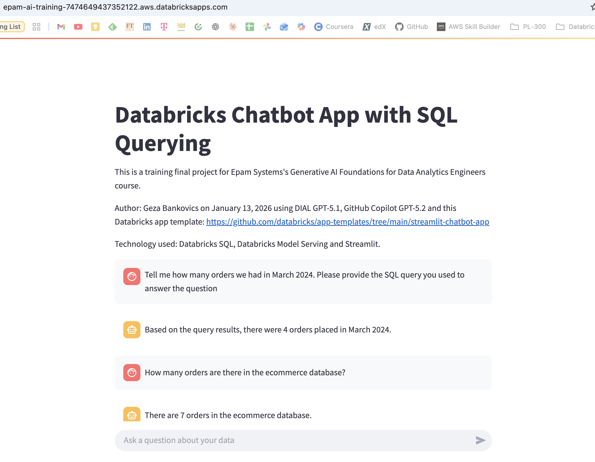
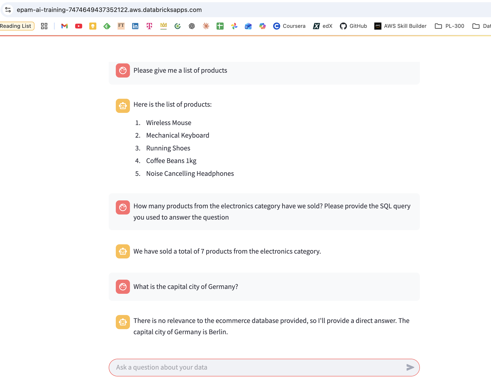

# Training final project for Epam Systems's Generative AI Foundations for Data Analytics Engineers course
Author: Joachim Geza Bankovics on January 13, 2026 using DIAL GPT-5.1, GitHub Copilot GPT-5.2 and this Databricks app template: [streamlit-chatbot-app](https://github.com/databricks/app-templates/tree/main/streamlit-chatbot-app)

# Practical API Scripts
- Serving endpoint used: databricks-meta-llama-3-1-8b-instruct
- Script (app.py):

`    if prompt := st.chat_input("Ask a question about your data"):
        st.session_state.messages.append({"role": "user", "content": prompt})
        with st.chat_message("user"):
            st.markdown(prompt)
            
        with st.chat_message("assistant"):
            assistant_msg, updated_messages = query_endpoint(
                endpoint_name=SERVING_ENDPOINT,
                messages=st.session_state.messages,
                max_tokens=400,
                tools=TOOLS,
                tool_choice="auto",
                tool_executor=tool_executor,
                max_tool_rounds=3,
            )
            assistant_content = assistant_msg.get("content") or ""
            st.markdown(assistant_content)`

- Script (model_serving_utils.py):

`def _query_endpoint(
    endpoint_name: str,
    messages: list[dict[str, Any]],
    max_tokens: int,
    tools: Optional[list[dict[str, Any]]] = None,
    tool_choice: Optional[Any] = None,
) -> list[dict[str, Any]]:
    """Calls a model serving endpoint. Returns a list of messages (agent schema) or a single assistant message in a list."""
    _validate_endpoint_task_type(endpoint_name)

    inputs: dict[str, Any] = {"messages": messages, "max_tokens": max_tokens}
    if tools is not None:
        inputs["tools"] = tools
        if tool_choice is not None:
            inputs["tool_choice"] = tool_choice

    res = get_deploy_client("databricks").predict(
        endpoint=endpoint_name,
        inputs=inputs,
    )

    # Agent endpoints (Databricks agent framework) may return multiple messages
    if isinstance(res, dict) and "messages" in res:
        return res["messages"]

    # Chat-completions endpoints (OpenAI-like)
    if isinstance(res, dict) and "choices" in res:
        choice_message = res["choices"][0]["message"]
        return [_normalize_chat_completion_message(choice_message)]

    raise Exception(
        "This app can only run against:"
        "1) Databricks foundation model or external model endpoints with the chat task type (described in https://docs.databricks.com/aws/en/machine-learning/model-serving/score-foundation-models#chat-completion-model-query)"
        "2) Databricks agent serving endpoints that implement the conversational agent schema documented "
        "in https://docs.databricks.com/aws/en/generative-ai/agent-framework/author-agent"
    )

ToolExecutor = Callable[[str, dict[str, Any]], str]
def query_endpoint(
    endpoint_name: str,
    messages: list[dict[str, Any]],
    max_tokens: int,
    tools: Optional[list[dict[str, Any]]] = None,
    tool_choice: Optional[Any] = "auto",
    tool_executor: Optional[ToolExecutor] = None,
    max_tool_rounds: int = 3,
) -> tuple[dict[str, Any], list[dict[str, Any]]]:
    """
    Query a chat-completions or agent serving endpoint.

    Returns:
        tuple: (final_assistant_message, all_messages_including_tool_calls)
    """
    # Work on a copy so callers can choose whether to persist tool messages or not.
    msgs = copy.deepcopy(messages)

    for _ in range(max_tool_rounds + 1):
        returned = _query_endpoint(
            endpoint_name=endpoint_name,
            messages=msgs,
            max_tokens=max_tokens,
            tools=tools,
            tool_choice=tool_choice if tools is not None else None,
        )

        # Agent endpoints may return a whole message trace; persist it.
        if len(returned) > 1:
            msgs.extend(returned)
            final_msg = returned[-1]
            return final_msg, msgs

        assistant_msg = returned[-1]
        tool_calls = assistant_msg.get("tool_calls")

        if not tool_calls:
            # Persist the final assistant message in history.
            msgs.append(
                {
                    "role": "assistant",
                    "content": assistant_msg.get("content") or "",
                }
            )
            return assistant_msg, msgs

        if tool_executor is None:
            raise Exception("Model requested tool_calls, but no tool_executor was provided.")

        msgs.append(
            {
                "role": "assistant",
                "content": assistant_msg.get("content") or "",
                "tool_calls": tool_calls,
            }
        )

        for call in tool_calls:
            fn = (call.get("function") or {})
            fn_name = fn.get("name")
            raw_args = fn.get("arguments", "{}")

            try:
                args = json.loads(raw_args) if isinstance(raw_args, str) else (raw_args or {})
            except Exception as e:
                raise Exception(f"Failed to parse tool arguments for {fn_name}: {raw_args}") from e

            result_str = tool_executor(fn_name, args)

            msgs.append(
                {
                    "role": "tool",
                    "tool_call_id": call.get("id"),
                    "content": result_str,
                }
            )

    raise Exception("Exceeded max_tool_rounds without reaching a final assistant response.")`

# Platform-Specific AI Integrations
- I’ve populated a trial Databricks catalog with a small data warehouse called “ecommerce”
- Generated some random dummy data INSERT INTO statements using DIAL GPT-5.1
- Added Databricks AI-generated descriptions to the schema’s tables to make AI-generated SQL queries work smoother
- Added the data warehouse to the chatbot app’s environment variables
- Generated Python function code using DIAL GPT-5.1 and GitHub Copilot GPT-5.2 to see if the user’s prompt requires a SQL query and in case yes, to use a function call tool without prompting the LLM twice. Then the same LLM should incorporate query results in its generated answer (see below)
- Free trial foundation models like meta-llama-3-1-8b-instruct seem limited in their ability to explain their reasoning. Prompting it to share the SQL query it employed didn’t actually succeed in incorporating the query code into its answers (see screenshots)
- The chatbot demonstrates flexibility for function calling. If the user’s prompt is not relevant to the database, it answers based on the foundation model’s training data (see screenshot prompt about Germany’s capital city)

# Screenshots

